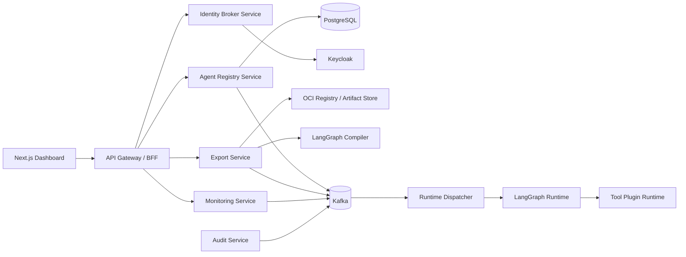

# Aegis Flow High-Level Design

## 1. Purpose

Aegis Flow is an enterprise agentic orchestration platform that lets users create, configure, export, deploy, and monitor autonomous AI agents.

The platform is designed for:

- Enterprise identity and governance
- Agent-as-principal security
- Stateful agent orchestration
- Event-driven distributed workflows
- Reliable export and deployment pipelines
- OCI-compliant portability

## 2. Architecture Overview

## 3. Architectural Principles

- Identity-first: every human and agent interaction is authenticated through Keycloak.
- Agent-as-principal: every deployable agent version has its own OIDC M2M identity.
- Event-driven by default: long-running workflows communicate through Kafka.
- Data ownership: each microservice owns its schema.
- Reliability by construction: sagas, inbox, outbox, retries, and DLQs are first-class.
- Portability: exported agents must be OCI-compliant and Kubernetes-ready.
- Observability: every command and event carries correlation and saga identifiers.

## 4. Logical Planes

### Control Plane

The control plane owns user-facing configuration and governance:

- Agent Registry
- Agent Builder
- Identity Broker
- Export Service
- Deployment Service
- Monitoring Service
- Audit Service
- Policy Service
- Next.js dashboard

### Execution Plane

The execution plane owns runtime activity:

- Runtime Dispatcher
- LangGraph Runtime
- Tool Plugin Runtime
- Agent Runtime Workers
- Checkpoint Store
- Kafka consumers and producers

## 5. Key Runtime Flows

- Agent creation and versioning
- Scope assignment and identity provisioning
- LangGraph workflow validation
- Agent export saga
- Agent deployment saga
- Agent execution lifecycle
- Runtime monitoring and audit ingestion
- DLQ review and replay

## 6. Deployment View

Aegis Flow should be deployable to Kubernetes with:

- One deployment per service
- PostgreSQL per bounded context or logical schema
- Kafka cluster
- Keycloak realm
- OCI registry integration
- OpenTelemetry collector
- Prometheus and Grafana
- Central log aggregation

## 7. Non-Functional Requirements

| Concern | Requirement |
| --- | --- |
| Security | OIDC, scoped M2M identities, tenant isolation |
| Reliability | Saga, inbox/outbox, retries, DLQ |
| Scalability | Kafka partitioning by tenant or aggregate ID |
| Portability | Docker, Kubernetes, Helm, SBOM, provenance |
| Observability | Metrics, logs, traces, audit records |
| Maintainability | Bounded contexts, clear contracts, schema migrations |
