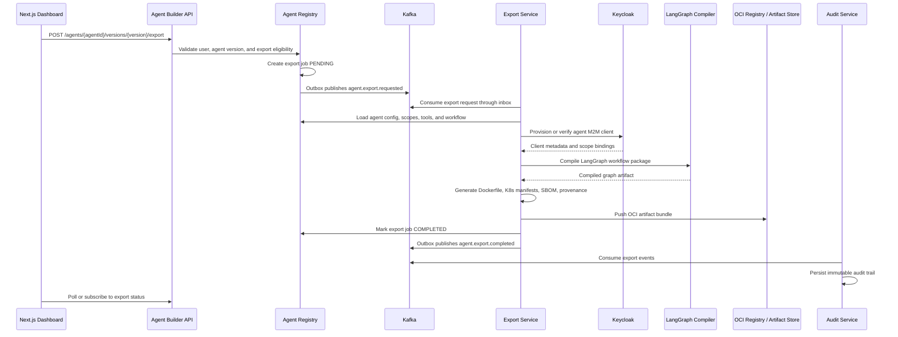

# Aegis Flow Architecture Blueprint

Aegis Flow is an enterprise agentic orchestration platform for creating, exporting, and deploying autonomous AI agents. The platform is identity-first, event-driven, cloud-agnostic, and designed around explicit service boundaries, reliable distributed workflows, and OCI-compliant portability.

This blueprint is based on the Aegis Flow requirements document and the target constraints:

- Keycloak OIDC/SSO identity layer
- Agents as OIDC machine-to-machine entities
- Quarkus microservice backend
- Kafka event backbone
- Saga pattern for distributed transactions
- Inbox/Outbox patterns for consistency
- Dead Letter Queue strategies for failed events
- LangGraph for stateful agent orchestration
- React + Next.js dashboard
- OCI-compliant export through Dockerfiles, Kubernetes manifests, and deployment bundles

## 1. Architectural Model

Aegis Flow should be split into two major planes.

### Control Plane

The control plane owns configuration, governance, export, deployment intent, and human interaction.

Core capabilities:

- Agent design and configuration
- Keycloak-backed identity and access control
- Agent registry and versioning
- Export request lifecycle
- Deployment request lifecycle
- Audit, compliance, and policy enforcement
- Dashboard and real-time monitoring APIs

Primary components:

- Next.js dashboard
- API gateway or BFF
- Identity Broker Service
- Agent Registry Service
- Agent Builder Service
- Export Service
- Deployment Service
- Audit Service
- Monitoring Service
- Policy Service

### Execution Plane

The execution plane owns runtime agent behavior and stateful orchestration.

Core capabilities:

- LangGraph workflow execution
- Agent runtime workers
- Tool and plugin invocation
- Kafka command/event processing
- Runtime observability
- Stateful checkpointing
- Failure handling and replay

Primary components:

- LangGraph Runtime Service
- Runtime Dispatcher Service
- Tool Plugin Service
- Agent Runtime Workers
- Kafka consumers/producers
- Checkpoint store
- Telemetry pipeline

## 2. Service Boundaries

| Service | Technology | Responsibility |
| --- | --- | --- |
| API Gateway / BFF | Next.js API routes or Quarkus | Frontend-facing aggregation, token validation, request routing |
| Identity Broker Service | Quarkus | Integrates with Keycloak Admin API, provisions agent M2M clients, manages scopes and service accounts |
| Agent Registry Service | Quarkus + PostgreSQL | Source of truth for agents, versions, capabilities, scopes, tools, and workflow references |
| Agent Builder Service | Quarkus | Validates agent definitions, tool bindings, policies, prompts, and LangGraph topology |
| Workflow Orchestrator Service | Quarkus + LangGraph bridge | Converts agent definitions into executable LangGraph workflow packages |
| Runtime Dispatcher Service | Quarkus + Kafka | Dispatches execution commands and tracks runtime lifecycle events |
| LangGraph Runtime Service | Python LangGraph or LangGraph4j boundary | Executes stateful graph workflows, checkpoints graph state, emits transition events |
| Tool Plugin Service | Quarkus | Manages tool metadata, allowed actions, sandbox policy, and secret references |
| Export Service | Quarkus | Generates OCI-compliant artifacts, Dockerfiles, Kubernetes manifests, SBOM, and provenance metadata |
| Deployment Service | Quarkus | Deploys exported agents to Kubernetes, OpenShift, or external deployment targets |
| Monitoring Service | Quarkus | Streams logs, graph state changes, token usage, execution status, and export progress |
| Audit Service | Quarkus | Stores immutable audit entries for identity, configuration, export, deployment, and execution events |
| Policy Service | Quarkus + optional OPA | Enforces authorization, export rules, runtime constraints, and data-access policy |

Each service should own its database schema. Cross-service state exchange should happen through Kafka events, not direct table reads.

## 3. Identity Layer

Keycloak is the identity authority for both human users and autonomous agents.

### Human Users

Use OIDC Authorization Code Flow with PKCE.

Recommended roles:

- `platform-admin`
- `tenant-admin`
- `agent-designer`
- `operator`
- `auditor`
- `viewer`

### Agents As M2M Entities

Every exported or deployable agent version must be represented as an OIDC machine-to-machine entity.

Recommended model:

- Each agent version maps to a Keycloak confidential client or service account.
- Client naming convention: `agent-{tenantId}-{agentSlug}-{version}`.
- Runtime authentication uses Client Credentials Flow.
- Tokens are short-lived and audience-restricted.
- Scopes are explicit, least-privilege, and version-specific.

Example scopes:

```text
agent:read
agent:execute
agent:export
tool:invoke:crm
tool:invoke:github
memory:read
memory:write
workflow:transition
event:publish
deployment:request
```

Secrets must not be embedded in exported artifacts. OCI exports should reference Kubernetes Secrets, Vault paths, or cloud secret manager references.

## 4. Backend Architecture

All core backend services should be implemented as Quarkus microservices.

Recommended Quarkus extensions:

- RESTEasy Reactive
- Quarkus OIDC
- Quarkus Security
- SmallRye Reactive Messaging Kafka
- Hibernate ORM Panache or jOOQ
- Flyway
- OpenTelemetry
- Micrometer / Prometheus
- Kubernetes Config
- Container Image Jib or Docker

Recommended storage model:

- PostgreSQL per bounded context
- Redis optional for ephemeral coordination only
- Object storage or OCI registry for generated bundles
- LangGraph checkpoint store backed by PostgreSQL or Redis, depending on durability requirements

## 5. Kafka Event Backbone

Kafka is the system backbone for asynchronous state changes, saga commands, runtime telemetry, and audit propagation.

Core topics:

```text
agent.command.requested
agent.config.validated
agent.identity.provisioned
agent.workflow.compiled
agent.export.requested
agent.export.validated
agent.export.identity-ready
agent.export.workflow-compiled
agent.export.packaged
agent.export.published
agent.export.completed
agent.export.failed
agent.deployment.requested
agent.deployment.completed
agent.execution.started
agent.execution.transitioned
agent.execution.completed
agent.execution.failed
audit.event.recorded
```

Each critical topic should have retry and DLQ topics:

```text
<topic>.retry.1m
<topic>.retry.5m
<topic>.retry.30m
<topic>.dlq
```

DLQ messages should include:

- Original topic, partition, and offset
- Message key
- Correlation ID
- Saga ID
- Tenant ID
- Agent ID and version ID
- Consumer name
- Failure class
- Failure message
- Stack trace hash
- Retry count
- Replay eligibility
- Timestamp

## 6. Saga, Inbox, And Outbox Strategy

Use orchestration-based sagas for business-critical workflows such as export, deployment, and execution lifecycle management.

Recommended saga coordinators:

| Saga | Coordinator |
| --- | --- |
| Agent Export Saga | Export Service |
| Agent Deployment Saga | Deployment Service |
| Agent Execution Saga | Runtime Dispatcher Service |
| Identity Provisioning Saga | Identity Broker Service |

Reliability rules:

- Each service writes domain state and outbox events in the same database transaction.
- Outbox relay publishes events to Kafka.
- Consumers write inbox entries before processing.
- Message handling must be idempotent.
- External side effects must use idempotency keys.
- Retry exhaustion routes events to DLQ.
- DLQ replay must be operator-controlled and audited.

## 7. Agent Registry Database Schema

```sql
CREATE TABLE agents (
  id UUID PRIMARY KEY,
  tenant_id UUID NOT NULL,
  slug VARCHAR(120) NOT NULL,
  name VARCHAR(200) NOT NULL,
  description TEXT,
  owner_user_id UUID NOT NULL,
  status VARCHAR(40) NOT NULL,
  created_at TIMESTAMPTZ NOT NULL,
  updated_at TIMESTAMPTZ NOT NULL,
  UNIQUE (tenant_id, slug)
);

CREATE TABLE agent_versions (
  id UUID PRIMARY KEY,
  agent_id UUID NOT NULL REFERENCES agents(id),
  version VARCHAR(40) NOT NULL,
  status VARCHAR(40) NOT NULL,
  runtime_type VARCHAR(40) NOT NULL,
  image_name VARCHAR(300),
  config_hash VARCHAR(128) NOT NULL,
  created_by UUID NOT NULL,
  created_at TIMESTAMPTZ NOT NULL,
  UNIQUE (agent_id, version)
);

CREATE TABLE agent_oidc_clients (
  id UUID PRIMARY KEY,
  agent_version_id UUID NOT NULL REFERENCES agent_versions(id),
  keycloak_realm VARCHAR(120) NOT NULL,
  keycloak_client_id VARCHAR(255) NOT NULL,
  service_account_user_id VARCHAR(255),
  status VARCHAR(40) NOT NULL,
  created_at TIMESTAMPTZ NOT NULL,
  UNIQUE (keycloak_realm, keycloak_client_id)
);

CREATE TABLE agent_scopes (
  id UUID PRIMARY KEY,
  agent_version_id UUID NOT NULL REFERENCES agent_versions(id),
  scope VARCHAR(160) NOT NULL,
  granted_by UUID NOT NULL,
  created_at TIMESTAMPTZ NOT NULL,
  UNIQUE (agent_version_id, scope)
);

CREATE TABLE agent_capabilities (
  id UUID PRIMARY KEY,
  agent_version_id UUID NOT NULL REFERENCES agent_versions(id),
  capability_type VARCHAR(80) NOT NULL,
  capability_name VARCHAR(160) NOT NULL,
  config_json JSONB NOT NULL,
  policy_json JSONB,
  created_at TIMESTAMPTZ NOT NULL
);

CREATE TABLE agent_tools (
  id UUID PRIMARY KEY,
  agent_version_id UUID NOT NULL REFERENCES agent_versions(id),
  tool_id UUID NOT NULL,
  tool_name VARCHAR(160) NOT NULL,
  allowed_actions JSONB NOT NULL,
  secret_ref VARCHAR(300),
  created_at TIMESTAMPTZ NOT NULL
);

CREATE TABLE langgraph_workflows (
  id UUID PRIMARY KEY,
  agent_version_id UUID NOT NULL REFERENCES agent_versions(id),
  graph_name VARCHAR(160) NOT NULL,
  graph_definition_json JSONB NOT NULL,
  entry_node VARCHAR(160) NOT NULL,
  checkpoint_strategy VARCHAR(80) NOT NULL,
  created_at TIMESTAMPTZ NOT NULL
);

CREATE TABLE export_jobs (
  id UUID PRIMARY KEY,
  agent_version_id UUID NOT NULL REFERENCES agent_versions(id),
  saga_id UUID NOT NULL,
  requested_by UUID NOT NULL,
  status VARCHAR(40) NOT NULL,
  target_format VARCHAR(40) NOT NULL,
  artifact_uri TEXT,
  error_message TEXT,
  created_at TIMESTAMPTZ NOT NULL,
  updated_at TIMESTAMPTZ NOT NULL
);

CREATE TABLE outbox_events (
  id UUID PRIMARY KEY,
  aggregate_type VARCHAR(120) NOT NULL,
  aggregate_id UUID NOT NULL,
  event_type VARCHAR(160) NOT NULL,
  topic VARCHAR(200) NOT NULL,
  payload JSONB NOT NULL,
  headers JSONB,
  status VARCHAR(40) NOT NULL,
  created_at TIMESTAMPTZ NOT NULL,
  published_at TIMESTAMPTZ
);

CREATE TABLE inbox_events (
  id UUID PRIMARY KEY,
  message_id VARCHAR(255) NOT NULL,
  topic VARCHAR(200) NOT NULL,
  consumer_name VARCHAR(160) NOT NULL,
  payload_hash VARCHAR(128) NOT NULL,
  status VARCHAR(40) NOT NULL,
  received_at TIMESTAMPTZ NOT NULL,
  processed_at TIMESTAMPTZ,
  UNIQUE (message_id, consumer_name)
);
```

## 8. Agent Export Saga

The Agent Export Saga converts a versioned agent definition into OCI-compliant deployment artifacts.

### Sequence Flow



### Saga Steps

1. `ExportRequested`
   - Create `export_jobs` row with `PENDING` status.
   - Emit `agent.export.requested`.

2. `ValidateAgentVersion`
   - Confirm agent version exists and is exportable.
   - Confirm caller has `agent:export`.
   - Confirm config hash matches latest immutable version.

3. `ProvisionOrVerifyIdentity`
   - Ensure Keycloak M2M client exists.
   - Bind required scopes.
   - Compensation: disable newly-created client if saga fails before completion.

4. `CompileWorkflow`
   - Validate LangGraph nodes and edges.
   - Validate tool references and policy constraints.
   - Produce compiled graph package.
   - Compensation: delete temporary compile artifacts.

5. `GenerateOCIArtifacts`
   - Generate Dockerfile.
   - Generate Kubernetes manifests.
   - Generate config contract.
   - Generate SBOM and provenance metadata.
   - Ensure secrets are referenced, not embedded.

6. `PublishArtifacts`
   - Push bundle to OCI registry or artifact store.
   - Compensation: delete unreferenced artifact or mark artifact as revoked.

7. `FinalizeExport`
   - Mark export job as `COMPLETED`.
   - Store artifact URI.
   - Emit `agent.export.completed`.

8. `NotifyAndAudit`
   - Emit dashboard update.
   - Persist audit trail.

### Failure Handling

Transient failures:

- Route through retry topics.
- Preserve saga ID and idempotency key.
- Resume from last completed saga step.

Permanent failures:

- Mark `export_jobs.status = FAILED`.
- Emit `agent.export.failed`.
- Run compensating actions.
- Send exhausted message to DLQ.
- Require operator review for replay.

## 9. OCI Export Contents

A generated export bundle should contain:

```text
Dockerfile
.k8s/deployment.yaml
.k8s/service.yaml
.k8s/service-account.yaml
.k8s/config-map.yaml
.k8s/secret-template.yaml
.k8s/network-policy.yaml
helm/Chart.yaml
helm/values.yaml
sbom/spdx.json
provenance/attestation.json
agent/agent-definition.json
agent/langgraph.json
agent/tool-policy.json
README.md
```

Docker image labels should include OCI metadata:

```text
org.opencontainers.image.title
org.opencontainers.image.description
org.opencontainers.image.version
org.opencontainers.image.revision
org.opencontainers.image.source
org.opencontainers.image.created
org.opencontainers.image.vendor
```

## 10. Next.js Dashboard Requirements

Dashboard modules:

- Agent Builder
- Agent Version Manager
- Identity and Scope Manager
- LangGraph Visual Editor
- Tool and Plugin Catalog
- Export Center
- Deployment Center
- Runtime Monitor
- DLQ Console
- Audit Viewer

Real-time features:

- Export progress updates over SSE or WebSocket
- Agent execution graph transitions
- Kafka consumer lag status
- DLQ count and replay state
- Runtime logs and traces

## 11. Observability And Governance

Minimum platform telemetry:

- OpenTelemetry traces across Quarkus services
- Kafka correlation IDs and saga IDs
- Prometheus metrics
- Grafana dashboards
- Loki or OpenSearch logs
- Audit records for all export and deployment activity

Governance controls:

- Per-tenant isolation
- Scope-based runtime permissions
- Policy checks before export and deploy
- Signed artifacts
- SBOM generation
- Immutable audit trail
- DLQ replay approval workflow

## 12. Recommended Delivery Roadmap

| Phase | Focus | Deliverable |
| --- | --- | --- |
| 1 | Foundation | HLD/LLD, Keycloak realm model, Quarkus service skeletons |
| 2 | Core Registry | Agent Registry schema, versioning, scopes, outbox/inbox foundations |
| 3 | Event Backbone | Kafka topics, saga coordinator, DLQ strategy |
| 4 | LangGraph Runtime | Workflow compilation, checkpointing, execution events |
| 5 | Dashboard | Next.js agent builder, identity panel, monitor views |
| 6 | Export | Dockerfile/K8s/Helm generation, SBOM, OCI publishing |
| 7 | Deployment | Kubernetes deployment, rollback, audit, replay workflows |
| 8 | Hardening | Security review, load testing, chaos testing, compliance controls |
