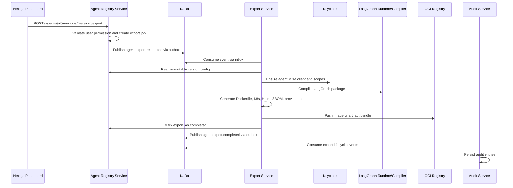

# Agent Export Saga

The Agent Export Saga converts a versioned agent definition into OCI-compliant artifacts that can be deployed to Kubernetes or distributed as a portable bundle.

## Saga Owner

`export-service` owns the saga orchestration. It coordinates validation, identity readiness, LangGraph compilation, OCI artifact generation, publishing, finalization, and compensation.

## Trigger

```http
POST /agents/{agentId}/versions/{version}/export
Authorization: Bearer <user-token>
Content-Type: application/json

{
  "targetFormat": "OCI_BUNDLE",
  "includeHelm": true,
  "includeSbom": true,
  "registry": "ghcr.io/example/aegis-agents"
}
```

The Agent Registry Service creates an `export_jobs` row and writes an outbox event to `agent.export.requested`.

## Sequence



## Saga State Machine

```text
PENDING
  -> VALIDATING
  -> IDENTITY_READY
  -> COMPILING_WORKFLOW
  -> PACKAGING
  -> PUBLISHING
  -> COMPLETED
```

Failure states:

```text
FAILED
CANCELLED
COMPENSATING
COMPENSATED
```

## Steps And Compensations

| Step | Action | Success Event | Compensation |
| --- | --- | --- | --- |
| Validate export | Confirm version, policy, scopes, and caller authorization | `agent.export.validated` | Mark export failed |
| Ensure identity | Verify or create Keycloak M2M client and bind scopes | `agent.export.identity-ready` | Disable newly-created client |
| Compile workflow | Compile LangGraph graph and validate tool references | `agent.export.workflow-compiled` | Delete temporary workflow artifact |
| Package artifacts | Generate Dockerfile, Kubernetes manifests, Helm chart, SBOM | `agent.export.packaged` | Delete temporary bundle |
| Publish artifact | Push to OCI registry or artifact store | `agent.export.published` | Delete or revoke unpublished artifact |
| Finalize export | Store artifact URI and mark job completed | `agent.export.completed` | Mark export failed and notify operator |

## Idempotency

All saga steps must be idempotent.

Recommended idempotency keys:

```text
export:{exportJobId}:validate
export:{exportJobId}:identity
export:{exportJobId}:compile
export:{exportJobId}:package
export:{exportJobId}:publish
export:{exportJobId}:finalize
```

## Kafka Events

### agent.export.requested

```json
{
  "exportJobId": "uuid",
  "agentId": "uuid",
  "agentVersionId": "uuid",
  "tenantId": "uuid",
  "targetFormat": "OCI_BUNDLE",
  "requestedBy": "uuid"
}
```

### agent.export.completed

```json
{
  "exportJobId": "uuid",
  "agentVersionId": "uuid",
  "artifactUri": "oci://registry/aegis-agent:1.0.0",
  "sbomUri": "oci://registry/aegis-agent:1.0.0-sbom",
  "completedAt": "2026-05-24T00:00:00Z"
}
```

### agent.export.failed

```json
{
  "exportJobId": "uuid",
  "agentVersionId": "uuid",
  "failedStep": "PUBLISHING",
  "failureClass": "OCI_REGISTRY_UNAVAILABLE",
  "failureMessage": "Registry request timed out",
  "compensated": true
}
```

## DLQ Policy

Retry transient failures through retry topics:

```text
agent.export.requested.retry.1m
agent.export.requested.retry.5m
agent.export.requested.retry.30m
agent.export.requested.dlq
```

Do not retry:

- Authorization failures
- Policy denials
- Invalid graph definitions
- Missing required scopes
- Malformed messages

Operator replay must be audited and must preserve the original `messageId`, `sagaId`, and `correlationId`.
